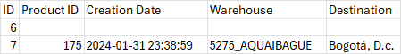

# Proyecto Spring Boot - VTEX Data Processor

Este proyecto es un servicio backend en Spring Boot que automatiza la recopilación de datos desde VTEX y los expone via REST y tareas programadas. A continuación se describe cómo configurar y ejecutar el proyecto.

---

## Requisitos previos

* Java 17 o superior
* Maven 3.6+
* Base de datos MySQL o MariaDB corriendo (versión 5.7+ / 10.x+)
* Git (para clonar el repositorio)

---

## Clonar el repositorio

```bash
git clone https://github.com/kevinLL22/cueros-velez.git
git checkout main
```

---

## Configuración de la base de datos

1. Crea la base de datos si no existe:

   ```sql
   CREATE DATABASE cuerose_velez;
   ```
2. Aplica el esquema (ejemplo DDL para `product_origin_destination`):

   ```sql
   CREATE TABLE product_origin_destination (
     id BIGINT NOT NULL AUTO_INCREMENT,
     product_id BIGINT,
     creation_date TIMESTAMP DEFAULT NULL,
     warehouse VARCHAR(50),
     destination VARCHAR(50),
     PRIMARY KEY (id)
   );
   ```

---

## Variables de entorno / configuración

El proyecto carga propiedades desde `src/main/resources/application.properties` o `application.yml`. Edita las siguientes claves:

```properties
# URL de conexión (ajusta host, puerto y nombre de BD)
spring.datasource.url=jdbc:mysql://localhost:3306/cueros_velez
spring.datasource.username=tu_usuario
spring.datasource.password=tu_contraseña
spring.datasource.driver-class-name=com.mysql.cj.jdbc.Driver

# URL de la API a consumir
api.url=https://cuerosvelezco.vtexcommercestable.com.br/api/oms/pvt/orders/
api.token= token vigente

# Pool HikariCP
spring.datasource.hikari.maximum-pool-size=10
spring.datasource.hikari.minimum-idle=2

# JPA / Hibernate
spring.jpa.hibernate.ddl-auto=validate
spring.jpa.show-sql=true
spring.jpa.properties.hibernate.dialect=org.hibernate.dialect.MySQLDialect

```
---

## Compilar y ejecutar
(Si tiene un IDE como intellij o similares puede abrir el proyecto con el IDE y ejecutar desde ApiConsumerApplication)

Desde la raíz del proyecto:

```bash
mvn clean install
mvn spring-boot:run
```

O bien genera el JAR y ejecútalo:

```bash
mvn clean package
java -jar target/nombre-del-proyecto-0.0.1-SNAPSHOT.jar
```

---

## Endpoints disponibles

* **POST** `/api/vtex/process`:

  * Ejecuta manualmente la tarea de recopilación de datos.
  * Respuesta: HTTP 202 Accepted.
  * Es indispensable recibir una url válida en el body de la petición.
  * Ejemplo de body:

    ```text
    
      {accountName}.vtexcommercestable.com.br/api/oms/pvt/orders?per_page=100&f_invoicedDate=invoicedDate%3A%5B2024-01-01T00%3A00%3A00.000Z%20TO%202024-01-31T23%3A59%3A59.999Z%5D&f_status=invoiced
    
    ```

* **GET** `/api/product-origins/export?start={fecha}&end={fecha}`:

  * Descarga un Excel con los registros `ProductOriginDestination` entre las fechas.
  * Parámetros `start` y `end` en formato ISO-8601, p.ej. `2025-05-01T00:00:00`.

---

## Tarea programada

El servicio incluye un scheduler que ejecuta automáticamente `VTEXService.processProductRouteData()` según la expresión cron configurada en `vtex.scheduler.cron`. Por defecto está deshabilitado si no configuras la propiedad.

---

## FAQ

* **¿Cómo cambio la frecuencia del scheduler?**
  Modifica `vtex.scheduler.cron` en `application.properties` o usa `fixedRateString`.

* **¿Dónde configuro el pool de conexiones?**
  En las propiedades `spring.datasource.hikari.*`.

---

## justificación de decisiones técnicas
* **Spring Boot**: Framework robusto y ampliamente utilizado para aplicaciones backend.
* **JPA/Hibernate**: Simplifica la interacción con la base de datos y permite un mapeo objeto-relacional eficiente.
* información guardada en base de datos: 
  - **product_id**: proporciona un id para diferenciar un producto de otro.
  - **creation_date**: permite saber cuándo se creo la factura y filtrar por fechas
  - **warehouse**: El nombre del almacén de origen.
  - **destination**: El destino del producto.
* Con estos datos es suficiente para tener una trazabilidad producto-origen-destino.
* Por qué retornar un excel: 
  - El excel es un formato ampliamente utilizado y fácil de manejar para la mayoría de los usuarios. Permite una visualización clara y ordenada de los datos, facilitando su análisis y manipulación.
  - Además, el uso de Excel permite a los usuarios realizar operaciones adicionales, como filtrado, ordenamiento y gráficos, sin necesidad de herramientas adicionales.

## Ejemplos de uso
* **Ejemplo de llamada a la API**:

- en postman llamar como "post" a la url: http://localhost:8080/VTEX/process
- Agregar como body en raw el siguiente texto:

```text 
https://{accountName}.vtexcommercestable.com.br/api/oms/pvt/orders?per_page=100&f_invoicedDate=invoicedDate%3A%5B2024-01-01T00%3A00%3A00.000Z%20TO%202024-01-31T23%3A59%3A59.999Z%5D&f_status=invoiced
```
- Cambiar {accountName} por el nombre de la cuenta de VTEX.
- Ejecutar la llamada y verificar que se haya guardado en la base de datos.

* **Ejemplo obtener excel**:
* Realizar una petición GET a la siguiente URL:

```text
http://localhost:8080/export?start=2023-05-01T00:00:00&end=2025-05-16T23:59:59
```
- Cambiar las fechas por las que necesites.
- Ejecutar la llamada y verificar que se descargue un archivo excel con los datos de la base de datos.
- obtendrá un archivo parecido a este:
  

- El archivo contiene las columnas product_id, creation_date, warehouse y destination.
- Con esos datos podrá saber el origen y destino de cada producto.
---
## pregunta de IA

- Escenario:
  "Queremos identificar qué productos tienen un patrón de distribución atípico (por ejemplo, salen mucho desde almacenes inusuales o van a ciudades donde normalmente no hay ventas). Imagina que ya tienes todos los datos logísticos almacenados."
- Entrenaría al modelo para obtener un vector de características, por ejemplo, a dónde suele ir el producto x cuando está almacenado en la ciudad Y; cuánta cantidad es comprada, con qué frecuencia. Etc. es decir, obtendría vectores del comportamiento típico.
  Después el modelo calcularía que tanto se desvía un producto de este comportamiento esperado.
- 
  Y no, no sería parte del backend, las tareas con IA consumen capacidad de procesamiento que puede volver más lentos otros procesos; serían dos tareas distintas en un solo backend, eso implicaría haces deploy innecesarios al actualizar uno de los dos servicios. En definitiva, a la IA no le debería interesar cómo ese dato se guardó en la base de datos, sino cómo se comporta ese dato con relación a los otros.
---
## pregunta final
- "Si tuvieras libertad total para mejorar un proceso digital en ecommerce usando backend + datos + inteligencia artificial, ¿qué harías y cómo lo llevarías a cabo?"
- Implementar un motor de recomendaciones personalizado para aumentar el ticket promedio y la retención de clientes, aprovechando datos de navegación y compras previas y compras similares de perfiles que coincidan. 
- cómo lo haría
   Captura de eventos
   Spring Boot + Apache Kafka: cada vez que un usuario vea o compre un producto, el frontend envía un evento VIEWED_PRODUCT o PURCHASED_PRODUCT a un topic en Kafka.
   Procesamiento y entrenamiento
-	AWS Glue (o un job de Spark local) lee los datos de S3, limpia y transforma:
     o	Filtra usuarios con pocas interacciones.
     o	Construye la matriz usuario–producto.
     o	Amazon SageMaker (o un microservicio Python con scikit-learn) entrena un modelo sencillo de filtrado colaborativo (por ejemplo, K-Nearest Neighbors o Matrix Factorization).

- El Frontend (React, Vue o Thymeleaf) consume /recommendations/{userId} y muestra la lista de productos recomendados en la página de inicio y en el checkout.
Desarrollo del backend
Configura productores y consumidores de Kafka.
Implementa el endpoint /recommendations/{userId} que invoque al modelo.
Añade Redis para cachear.

---
lopez.kevin.45678@gmail.com
